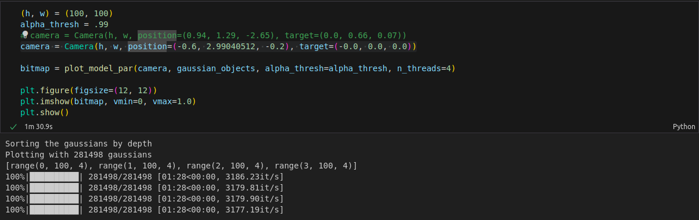
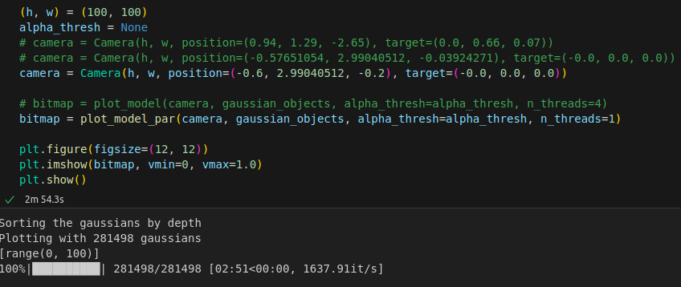
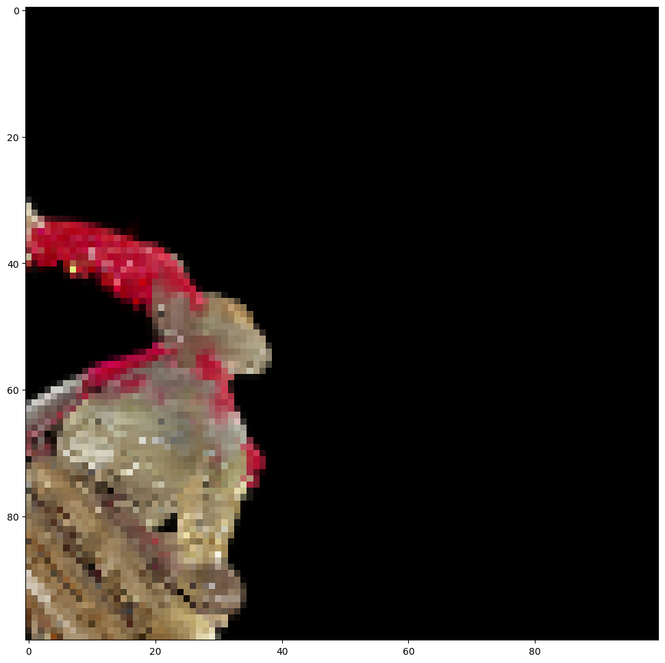
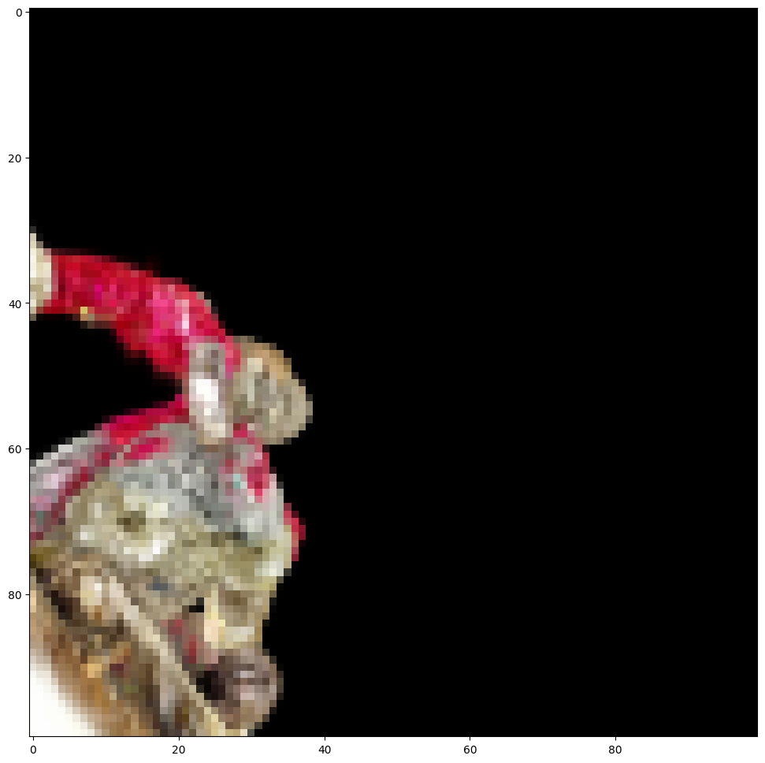

# Valentines Splats
Today I started looking into actually implementing VoxGraf for CPU. 
However, it depends on some libraries that require CUDA, such as svox2, which means that I either have to implement the necessary functionality myself, or buy an NVIDIA GPU.
This was out of scope in my opinion, so I looked for other potential avenues.

## 3D Gaussian splats
A very cool paper that got a best paper award [3D Gaussian Splatting for Real-Time Radiance Field Rendering by Kerbl et al.](https://arxiv.org/abs/2308.04079). 
Essentially, it remedies a problem that NERF models have by representing 3D scenes as "efficient" mixtures of gaussian distributions.
Here, "efficient" just means that one does not have to rely on sampling points to reconstruct the scene (as with NERFs), eliminating randomness and lowering computational cost. 
Further, the results show high fidelity and are fast to generate.
The basic idea is to create a number of gaussian distributions, to which we associate a color and an opacity, and flexibly add and remove these distributions in order to get a representation of the object which is quick to reconstruct.

There is also a CPU implementation by [Thomasanthony](https://github.com/thomasantony/splat) on GitHub, which I played around with.
This implementation is good to get started, but there are many optimizations one could make. 
One such optimization is simply parallellizing the generation of new images, as is also done in the original paper.
Today, I did this, and implemented a stopping cirterion based on a pixel's saturation (also done in the paper), speeding up the generation I tried by about 2x (the code is currently in a messy notebook, as I still consider this ideation, however, I will structure it more nicely next time I work on this). 

I have other ideas for optimizations - e.g. if we generate a low-resolution pixture, I imagine we could get away with much fewer gaussian centers than for full models (in my test experiment, the Splat has 2.8M centers). 
In my next sessions, I will try to think more about this, as well as whether other optimizations such as quantization and low-rank representations are useful for gaussian splats (the transfer is not direct because it does not use neural components, but there could probably still be memory to save).

## Pictures
Below are pictures to supplment the above. 
We do see that the slower generated image (in this case) has somewhat higher fidelity than the quickly generated one.
Note also the low resolution since I still consider this playing around, and because I have not yet optimized the runtime enough that regularly running high resolution generation is feasible. 

However, removing the alpha_threshold only added another 15 seconds to the computation, which indicates a good speedup, and we could have also paralellized with more threads than 4 (as I did here).

*Notebook with runtimes in optimized version where we stop once we reach a saturation of .99, and run 4 parallell threads*

*Notebook with runtimes in un-optimized version*

*Quickly generated image*

*Slower generated image*
