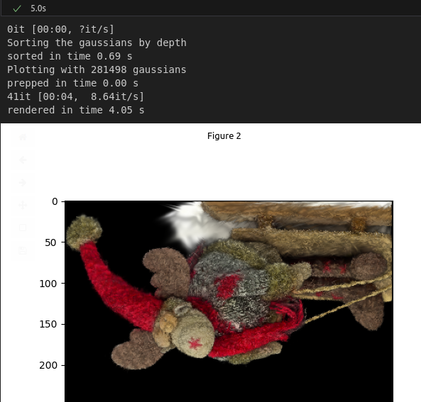

# MultiGaussian Speedups
I tried implementing the idea using math described in the last post today, but was unable to make it run fast at all.
Instead, I rooted for 
- Moving sorting distances to the `MultiGaussian` object
- directly loading a `MultiGaussian` object from the ply file and
- making it fast to select a subset of Gaussians from the `MultiGaussian`
which brought the rendering time down from seven to five seconds (see screenshot)

This marks the end of the blogs for now, because I am happy-ish with the speedups, and further speedups will take longer to come up with, or it's not obvious that they will work well - for example:
- we could start computing the alphas while sorting; it's unclear whether the speedup from this will be significant due to potential overhead of later retrieing the relevant tensors
- in the Gaussian Splats paper, they stop rendering after reaching a certain alpha threshold. 
The added overhead of checking whether a threshold has been reached resulted in no speedup here.

I might publish another entry here if there is large progress made.
