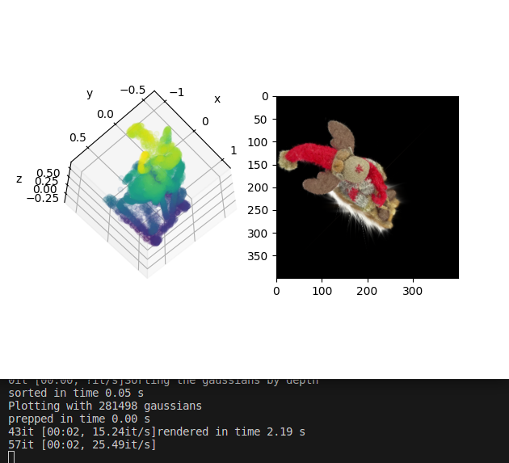

# Quick Maths
Improved speed further, mainly by
- changing implementation of `GaussianModel.get_depth` (`GaussianModel` replaces `MultiGaussian`)
- using some math to compute alphas directly as a `numpy.ndarray` (see below) instead of looping
- Breaking the picture into tiles, which allowed pruning when max depth is reached

Also implemented a crude visualizer in `visualization.py`, but it's still not perfectly consistent.

## Example from Visualizer

## The Promised Math
Using over-blending with alphas, we let $\alpha_i$ denote the alpha value having rendered the $i$-th Gaussian, sorted by depth, for a fixed 2D pixel pair.
We have the recursion
$$\alpha_i = \alpha_{i-1} + (1-\alpha_{i-1})\cdot\bar\alpha_{i}, \bar\alpha_0 = \alpha_0 = 0$$
where $\bar\alpha_i$ is the alpha value of the $i$-th Gaussian.

We have the recursion
$$(1, \alpha_i)^T = ((1, 0), (\bar\alpha_i, 1-\bar\alpha_i))(1, \alpha_{i-1})^T$$
which (proof by induction) can be used to see that 
$$\alpha_i = \Sigma_{0\leq j\leq i} \bar\alpha_j\frac{r_i}{r_j}$$
where $r_i = \Pi_{1\leq j\leq i} (1-\bar\alpha_j)$.

This can be implemented in numpy, calculating $r_i$ with `np.cumprod` and thereafter $\alpha_i$ with `np.cumsum`.
We create an array which stores for each Gaussian and each pixel the alpha attained (truncated at some threshold and depending on the part of the picture it is in), multiply by colors and then sum along the axis describing the Gaussians to get the final picture.

This is the math referred to in the post on March $6^{th}$; I don't by any means think these are novel results, but it was fun figuring them out.

## Speedups Tried with no Merit
- Filtering renedered gaussian based on values in tiles to be rendered
- pre-computing a max depth for alpha computation and filling with ones thereafter, instead of using the math above to compute all alphas, even though they might not be rendered
- pre-computing linspaces for tiles with numpy methods, rather than on the fly when rendering

## Issues
There are some bugs in the code, but I'm releasing it anyway, to take my mind off it
- The visualizer doesn't really work, some angles are inconsistent. 
However, it does the job for now.
- Depths are calculated with a negative sign compared to what I thought would be correct.
Haven't investigated.
- Other TODOs in `GaussianModel`
- The function `GaussianModel.render_old` (currently not working because I favored the current rendering method) is faster for rendering pictures of resolutions higher than 400x400.
Will look into dynamically choosing which method to render with, but for now, I stick with the one that is faster for lower resolution images.